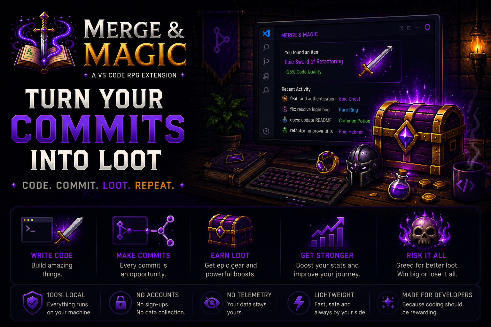
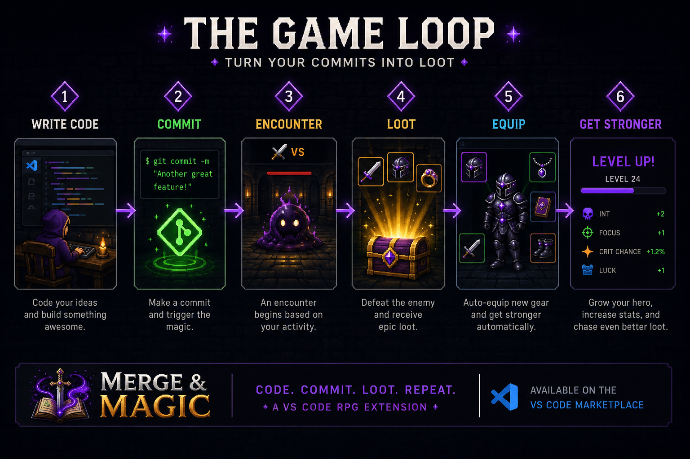
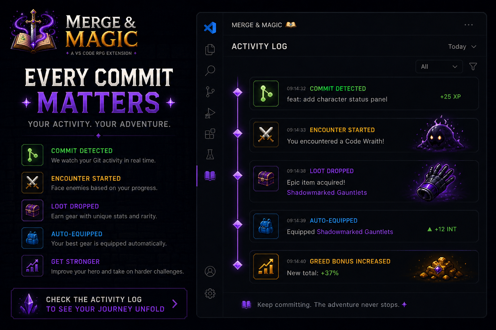
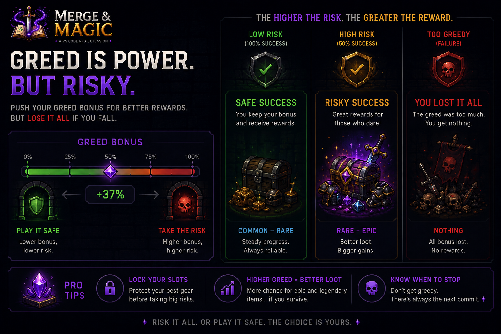
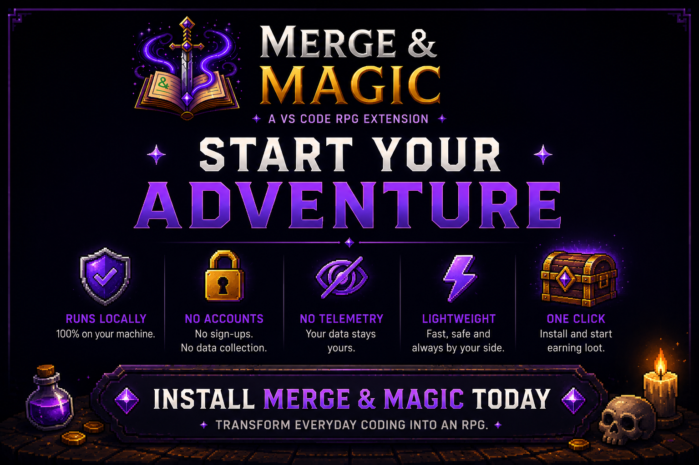

# Merge & Magic

Merge & Magic turns everyday coding activity into a small idle RPG inside VS Code.

Work in your editor, let encounters happen, collect gear, lock the pieces you want to keep, and watch your developer-adventurer slowly become less embarrassing in combat.

It is intentionally lightweight: no build dashboards, no productivity scoring, no guilt machine. Just a tiny RPG loop living beside your code.

## How it works

## Activity Log

## Risk vs Reward

## Start Your Adventure

## Features

- Idle RPG progression driven by editor and Git activity.
- Automatic encounters with enemies, XP, gold, and loot drops.
- A 3x3 equipment grid with weapons, armor, jewelry, boots, gloves, and shield.
- Lockable equipment slots so good items are protected from replacement.
- Greed bonus for keeping slots unlocked and accepting risk.
- Town visits where your character heals and shops for upgrades.
- Passive recovery after defeats.
- A dedicated activity bar view that can stay open while you work.
- Hero naming and title selection when you first start, plus a settings drawer to change them later.
- A progression achievements page with RPG-style achievement cards and title rewards.
- Unlockable titles that can be selected from the hero identity screens once earned.

## How It Works

Merge & Magic listens for normal development activity and turns some of it into RPG events.

Editor activity builds toward a focus session. After 5 minutes of observed activity, the session completes.

Git activity can trigger encounters, including commits, branch switches, pulls, pushes, merges, conflicts, and stashes. Git-triggered encounters have a 5-minute cooldown so normal repo work does not flood your log.

When an encounter starts, your character fights a random enemy. Victory grants XP and gold, and may drop an item. Defeat deals damage. If your HP gets too low, recovery starts and activity rewards pause until you heal.

## What Triggers Rewards

Merge & Magic rewards activity in a few different ways:

- **Editor activity** builds focus progress. After 5 minutes of observed editor activity, a focus session completes and is logged.
- **Git activity** can trigger encounters. This includes commits, branch switches, pulls, pushes, merges, conflicts, and stashes.
- **Winning encounters** grants XP and gold, and may also drop loot.
- **Town visits** can buy and equip items with gold while also healing your character.
- **Hero identity** starts with a name and title prompt, and can later be edited from the settings drawer.
- **Achievements** track long-term goals and can reward titles when unlocked.

Some activity is intentionally throttled. Git-triggered encounters have a 5-minute cooldown, and town entry has a 5-minute cooldown. While you are in town or recovering from defeat, most activity rewards pause.

## Loot And Locks

Loot is risky by design. When an item drops, it targets its equipment slot and replaces whatever is there.

Click a slot to lock or unlock it.

- Locked slots protect the item inside.
- Unlocked slots can receive upgrades.
- More unlocked slots increase your greed bonus, improving loot-drop chance.
- More locked slots slightly reduce your high-rarity odds.

The best strategy is usually to lock your favorite pieces and leave weaker slots open for upgrades.

## Town

Use **Go to town** when you want to spend gold.

While in town, Merge & Magic periodically offers shop items and applies inn healing. If you can afford an item and its slot is unlocked, it can be bought and equipped. If an item is too expensive, you leave town.

Town entry has a 5-minute cooldown. The town button shows the remaining countdown while town is restocking.

## Recovery

When defeated badly enough, your character enters recovery. Recovery completes passively after a few minutes.

A Git commit restores HP immediately. Consider it a heroic campfire with a hash.

## Commands

Merge & Magic is meant to be played from its activity bar view. The command palette is intentionally quiet for release.

- **Merge & Magic: Reset Save** starts over from a fresh save.

## Tips

- Keep the sidebar open if you want the idle-game feel while coding.
- Lock rare or important gear before taking more risks.
- Leave empty or weak slots unlocked so drops have somewhere useful to land.
- Visit town after building up gold.
- Reset save is permanent for the extension's local save state.

## Privacy And Data

Merge & Magic stores game state in VS Code global extension storage on your machine.

The extension observes editor and Git activity only to drive local game events. It does not send your code, repository data, commits, or game state to an external service.

## Current Scope

This is a compact idle RPG, not a full character-builder yet. Gear has generated names, rarity, item level, icons, and stats, and those stats feed the current combat loop. Deeper stat identity and buildcraft are good future expansion territory.

## Requirements

VS Code 1.80.0 or newer.

Git-based activity rewards require the built-in VS Code Git extension to be available for the workspace.
